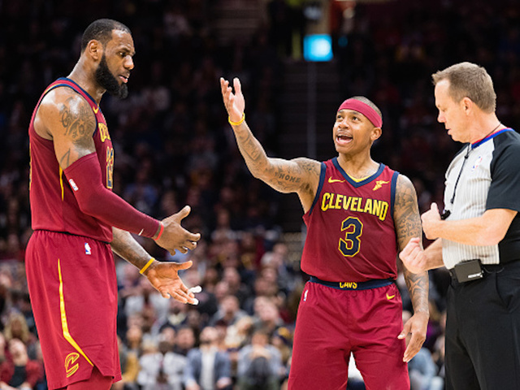

# Cavliers and the 2018 NBA Trade Deadline

## Summary

Shockingly, the NBA community changed with a wide trade of basketball players by the Cleveland Cavliers. In this trade, management hoped, as rumored, to have a younger cast of players centered around their key player(s). 

In this analysis, we briefly look into the performance of members that remainded in the team from the 2018 NBA Trade Deadline.

## Directory

1. [Analysis](Analysis/)
2. [Data](Data/)
3. [Resources](Resources/)

## Data Dictionary
1. G
2. Date
3. Age
4. Tm
5. Location
6. Opp
7. Point Margin
8. GS
9. MP
10. FG
11. FGA
12. FG%
13. 3P
14. 3PA
15. 3P%
16. FT
17. FTA
18. FT%
19. ORB
20. DRB
21. TRB
22. AST
23. STL
24. BLK
25. TOV
26. PF
27. PTS
28. GmSc
29. +/-
30. Player
31. Outcome

## Resources

[Cavs Roster after 2018 NBA Trade Deadline](https://www.si.com/nba/2018/02/08/cavs-roster-2018-nba-trade-deadline-lebron-james)

https://www.quora.com/In-the-NBA-which-advanced-statistic-is-most-valuable

https://www.reddit.com/r/nba/comments/35uwhl/what_statistics_are_most_important_in_nba_new/
