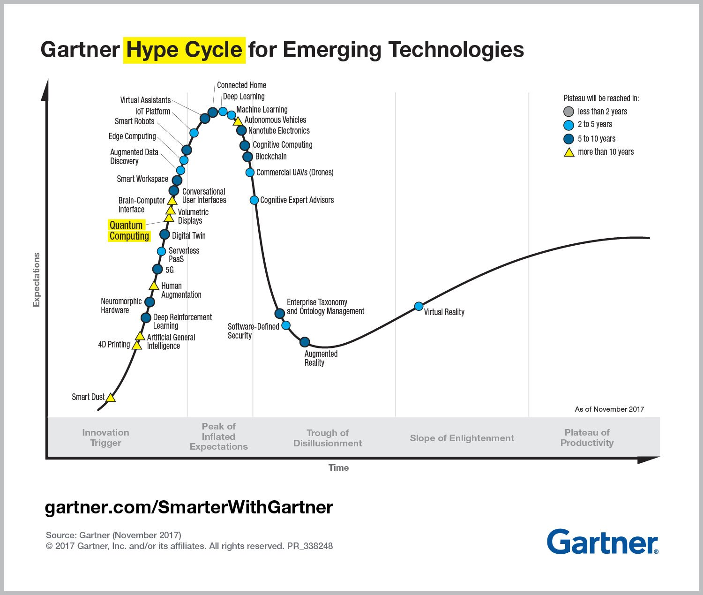

# Exploratory Data Analysis and Sentinment Analysis of Trending Tech Words

## 1.0 Summary

Expoloration and Analysis of trending tech words such as:

1. AI

2. Data

3. Blockchain

and more!

We want to identify from a list of trending topics in technologies how they are trending.

        
For these trends, how frequent are mentioned in twitter?

What is the count of their mentions per minute, hour, week, year?

For their mentions about the topics, do they appear to be excited about the concepts, over time?

What fraction of the twitter verse do they dominate with respect to hour collection of words?

What is their velocity over time? Moreover, in their velocity, has it declined recently?

What conclusions can we make about some of trending topics?

## 2.0 Directory

1. [Analysis](Analysis/)

2. [Data](Data/)

3. [Resources](Resources/)

## 3.0 Data Dictionary

## 4.0 Resources